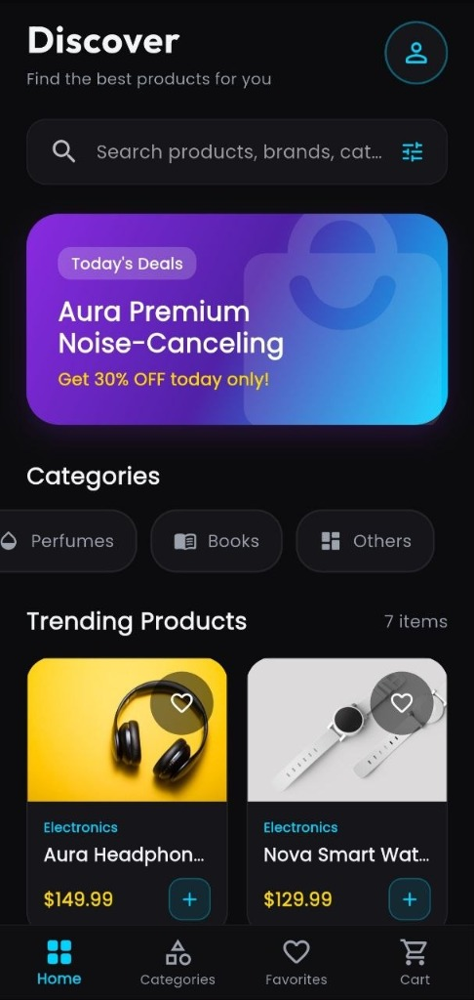
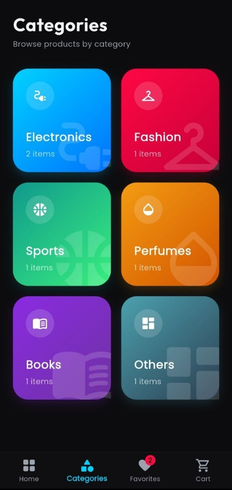
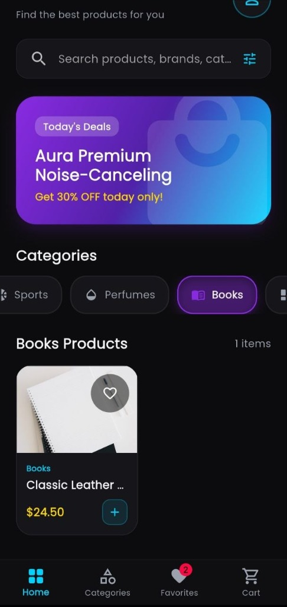
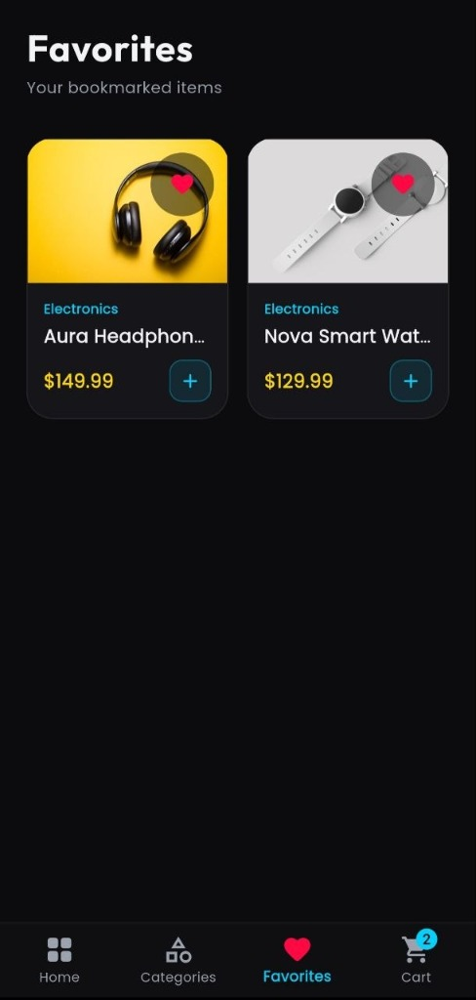
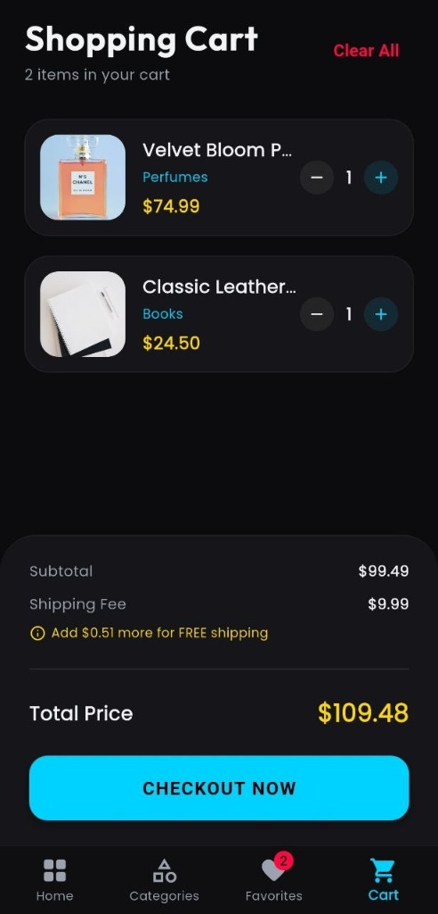

# Premium E-Commerce App (Flutter + Provider)

A state-of-the-art Flutter e-commerce application designed with a sleek, dark glassmorphism theme. The project utilizes the **Provider** pattern for reactive state management, separating the business logic from visual presentation.

---

## 📸 App Showcase

| Home (Discover) | Categories | Filtered Products |
| :---: | :---: | :---: |
|  |  |  |

| Favorites | Shopping Cart |
| :---: | :---: |
|  |  |

---

## ✨ Features

- **🌐 Global State Management**: Leverages `ChangeNotifier` and `Provider` to sync state seamlessly across the main navigation pages (Home, Categories, Favorites, Cart).
- **🏠 Discover Page**: 
  - Dynamic product search bar (responsive and overflow-safe).
  - High-impact gradient promotional banner ("Today's Deals").
  - Horizontal scrollable Category filters (`All`, `Electronics`, `Fashion`, `Sports`, `Perfumes`, `Books`, `Others`).
  - Interactive grid of product cards with instant favorite bookmarking and one-click add to cart.
- **🗂️ Categories View**: Beautiful 2x3 grid showcasing product categories utilizing glowing linear gradients and real-time item counters.
- **❤️ Favorites View**: Displays bookmarked items with a responsive "empty favorites" illustration and call-to-action to explore products.
- **🛒 Shopping Cart**: 
  - Tracks items and quantities.
  - Supports incremental adjustments (+/-) and swipe-to-delete behavior.
  - Free shipping indicator (notifies user how much more is needed to unlock free shipping).
  - Immersive checkout completion success dialog.

---

## 🛠️ Tech Stack & Architecture

- **Framework**: [Flutter](https://flutter.dev) (Dart)
- **State Management**: [Provider](https://pub.dev/packages/provider)
- **Typography**: [Google Fonts (Outfit & Poppins)](https://pub.dev/packages/google_fonts)
- **Icons**: Cupertino & Material Icons

### Project Structure:
```text
lib/
  ├── models/
  │     └── product.dart          # Product data structures
  ├── providers/
  │     └── shop_provider.dart    # Shared state logic (Cart, Favorites, Categories)
  ├── theme/
  │     └── app_theme.dart        # Unified dark color guidelines and styles
  ├── widgets/
  │     ├── product_card.dart     # Responsive item card with detail sheet
  │     ├── category_chip.dart    # Smooth, animated category selector
  │     └── cart_item_tile.dart   # Interactive list item tile (Swipe to dismiss)
  ├── screens/
  │     ├── main_navigation.dart  # IndexedStack bottom navbar container
  │     ├── home_screen.dart      # Discovery screen
  │     ├── categories_screen.dart# Visual grid of categories
  │     ├── favorites_screen.dart # Bookmark lists
  │     └── cart_screen.dart      # Shopping cart & checkout flow
  └── main.dart                   # Global Provider context initialization
```

---

## 🚀 Getting Started

### Prerequisites
Make sure you have Flutter installed. If not, follow the [official Flutter installation guide](https://docs.flutter.dev/get-started/install).

### Installation & Run

1. Clone the repository:
   ```bash
   git clone https://github.com/AL-SORORI/Store.git
   cd Store
   ```

2. Fetch all required dependencies:
   ```bash
   flutter pub get
   ```

3. Run the application (ensure a device or emulator is connected):
   ```bash
   flutter run
   ```

---

## 🌟 Submission & Requirements Met

- [x] Used `ChangeNotifier` to manage application state.
- [x] Used `Provider` to propagate state to widgets.
- [x] Separated UI code from core business logic.
- [x] Created automatic, reactive UI updates.
- [x] Implemented Add to Cart and Favorites triggers.
